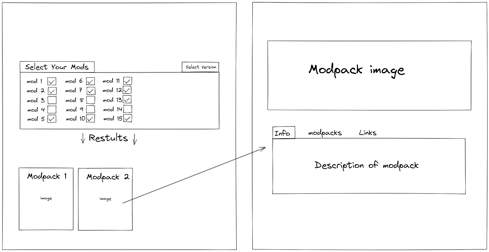

# ModpackFinder(name may change)

ModpackFinder is a site for finding the perfect minecraft modpack for you and your friends. Minecraft allows us to add mods to the game
such as adding airplanes, new plants, food, furniture, and whatever else you could possibly think of. However, everyone has different mods
that they enjoy, so you can find groups of mods already put together called modpacks. Installing a modpack ensures that everyone has all the
same mods, and there are no conflicting files or versions. 
    My app will allow users to select mods that they like, and it will show all the pre-built mod packs that include those mods. The reason
for this idea is that when my friends and I are choosing what pack to play, we have very different tastes in mods. I like tech mods, my friends like magic mods. So with this app, I can select the mods we BOTH like, and it will show us a pack that includes those mods.

# Wireframe

# Stretch Goals

 - User Accounts
 - ability to select a different version